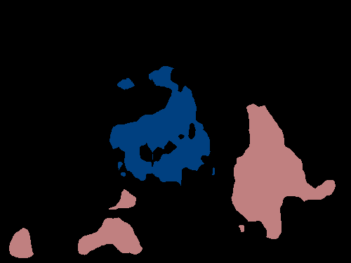
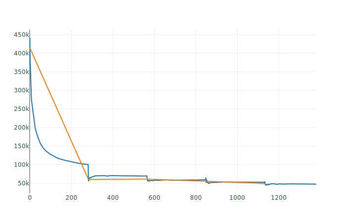
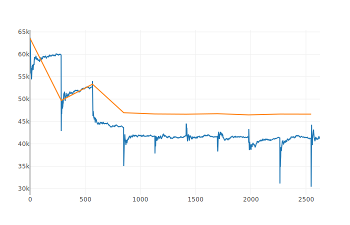

# Fully Convolutional Networks for Semantic Segmentation

pytorch 0.2.0
visdom

## Result

原图 标签 预测
  
  

## 训练过程

使用 SBD(Semantic Boundaries Dataset)训练集，验证集是PASCAL VOC 2012  

fcn8 3epoch 时  
Accuracy: 88.5370091544
Accuracy Class: 68.73723663  
Mean IU: 55.1793869933
FWAV Accuracy: 80.5496839107  
  

fcn8 继续训练到9epoch 时  
Accuracy: 91.3853625064  
Accuracy Class: 76.9016720714  
Mean IU: 64.6996659807  
FWAV Accuracy: 84.8389738198  

## 参考

https://github.com/wkentaro/pytorch-fcn  
https://github.com/ZijunDeng/pytorch-semantic-segmentation  
https://github.com/shelhamer/fcn.berkeleyvision.org   
